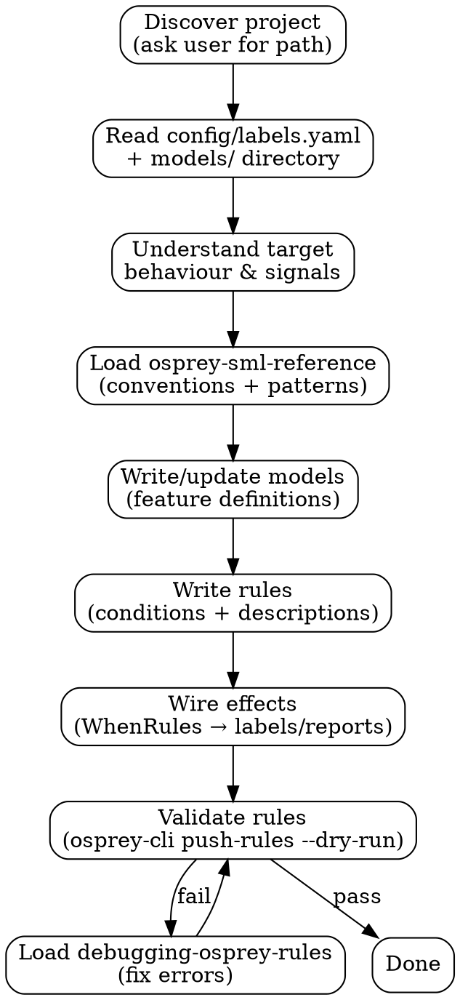
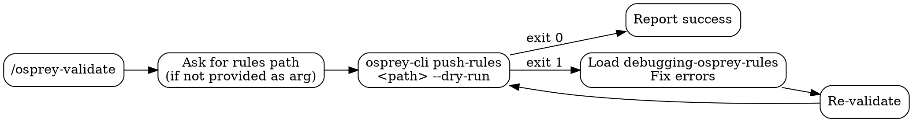

# Osprey Rules Plugin Design

## Summary

This plugin teaches Claude Code how to work with Osprey, a moderation rule engine for atproto (the protocol underlying Bluesky). Osprey rules are written in SML — a domain-specific language with its own type system, operator conventions, and project structure. Without guidance, Claude produces plausible-looking but invalid SML; this plugin fixes that by loading the right knowledge at the right time.

The approach is a Claude Code plugin with three skills (rule writing, SML reference, debugging), one specialized agent, and a slash command for validation. Skills are separated by concern and loaded on demand rather than baked into a monolithic prompt. Reference material (labeling patterns, conventions) ships inside the plugin and is read via progressive disclosure. Project-specific information — available labels, feature models, directory layout — is discovered at runtime from the user's actual rules project, keeping the plugin path-agnostic and safe to distribute publicly. Validation delegates entirely to `osprey-cli push-rules --dry-run` rather than reimplementing Osprey's own validation logic.

## Definition of Done

A Claude Code plugin (`osprey-rules-plugin`) that enables Claude to write, edit, and validate Osprey SML moderation rules for atproto. The plugin contains a skill (SML rule-writing knowledge + progressive-disclosure references), a specialized agent for rule work, and a slash command for validation. The skill dynamically discovers the user's rules project rather than hardcoding paths. Reference material (labeling patterns, UDF/effects list, conventions) is bundled within the plugin. The plugin is self-contained and structured for open-source distribution.

Success means: Claude writes correct SML rules following conventions when the skill is active, can navigate and modify an existing Osprey rules project, and the plugin is installable by anyone with an Osprey rules project.

Out of scope: MCP server/API integration, rule deployment to running Osprey instances, modifications to the Osprey engine itself.

## Acceptance Criteria

### osprey-rules-plugin.AC1: SML reference material is accurate and discoverable
- **osprey-rules-plugin.AC1.1 Success:** SKILL.md contains correct SML type system (`JsonData`, `EntityJson`, `Entity`, `Optional`) with usage examples
- **osprey-rules-plugin.AC1.2 Success:** Reference file links in SKILL.md resolve to existing files with content
- **osprey-rules-plugin.AC1.3 Success:** All 24 labeling patterns from existing `labeling-patterns.md` are represented with template code
- **osprey-rules-plugin.AC1.4 Success:** Conventions match those in existing CLAUDE.md (naming, time constants, IncrementWindow keys, RegexMatch rules)
- **osprey-rules-plugin.AC1.5 Failure:** Skill does not load when triggered by unrelated queries

### osprey-rules-plugin.AC2: Rule authoring workflow produces valid rules
- **osprey-rules-plugin.AC2.1 Success:** Skill asks user for rules project path on first invocation
- **osprey-rules-plugin.AC2.2 Success:** Skill reads `config/labels.yaml` and `models/` from discovered project
- **osprey-rules-plugin.AC2.3 Success:** Generated rules follow project structure conventions (correct directory, index.sml wiring)
- **osprey-rules-plugin.AC2.4 Success:** Generated rules use `EntityJson` for ID values, not `JsonData`
- **osprey-rules-plugin.AC2.5 Success:** Skill chains to `osprey-sml-reference` when conventions are needed
- **osprey-rules-plugin.AC2.6 Success:** Skill mandates validation via `osprey-cli push-rules --dry-run` after writing
- **osprey-rules-plugin.AC2.7 Failure:** Skill does not generate rules with hardcoded label names not present in `config/labels.yaml`

### osprey-rules-plugin.AC3: Debugging skill resolves common validation errors
- **osprey-rules-plugin.AC3.1 Success:** Skill identifies type mismatch errors (mixing `RuleT` and `bool` in `when_all`)
- **osprey-rules-plugin.AC3.2 Success:** Skill identifies import cycle errors and suggests resolution
- **osprey-rules-plugin.AC3.3 Success:** Skill identifies undefined variable errors
- **osprey-rules-plugin.AC3.4 Success:** Skill mandates re-validation after applying fixes
- **osprey-rules-plugin.AC3.5 Edge:** Skill handles multiple simultaneous validation errors

### osprey-rules-plugin.AC4: Agent correctly delegates to skills
- **osprey-rules-plugin.AC4.1 Success:** Agent loads `writing-osprey-rules` for "write a rule" tasks
- **osprey-rules-plugin.AC4.2 Success:** Agent loads `debugging-osprey-rules` for "fix this error" tasks
- **osprey-rules-plugin.AC4.3 Success:** Agent loads `osprey-sml-reference` for "what patterns exist" tasks
- **osprey-rules-plugin.AC4.4 Failure:** Agent does not bake skill content into its own prompt

### osprey-rules-plugin.AC5: Validation command works end-to-end
- **osprey-rules-plugin.AC5.1 Success:** `/osprey-validate <path>` runs `osprey-cli push-rules <path> --dry-run` and reports result
- **osprey-rules-plugin.AC5.2 Success:** Command asks for path when no argument provided
- **osprey-rules-plugin.AC5.3 Failure:** Command reports clear error when `osprey-cli` is not installed, with install instructions
- **osprey-rules-plugin.AC5.4 Failure:** Command reports validation errors from `osprey-cli` output without swallowing them

### osprey-rules-plugin.AC6: End-to-end quality under TDD
- **osprey-rules-plugin.AC6.1 Success:** Subagent with skills loaded produces rules that pass `osprey-cli push-rules --dry-run`
- **osprey-rules-plugin.AC6.2 Success:** Baseline without skills shows measurable quality degradation
- **osprey-rules-plugin.AC6.3 Success:** Known rationalizations are explicitly blocked in skill text

## Glossary

- **atproto**: The AT Protocol — an open, federated protocol for social networking that underlies Bluesky. Osprey is a moderation layer for atproto networks.
- **Claude Code plugin**: A local extension to Claude Code that bundles skills, agents, and slash commands into a single installable directory. Installed via `/plugin install`.
- **SML (Semantic Moderation Language)**: Osprey's domain-specific language for defining moderation rules. Has its own type system, operators, and execution model distinct from general-purpose languages.
- **skill**: In Claude Code, a markdown file (`SKILL.md`) that loads domain knowledge and workflow instructions into Claude's context when triggered. Skills are loaded on demand, not pre-loaded.
- **agent**: In Claude Code, a configured subagent with declared tool access and a role prompt. Invoked via the Task tool; loads skills itself rather than embedding their content.
- **slash command**: A `/name` command available in Claude Code, defined as a markdown file. Can run tools, load skills, and interact with the user.
- **progressive disclosure**: A skill design pattern where `SKILL.md` contains core knowledge and links to `references/` subdirectory files for detailed content, avoiding context overload on every invocation.
- **Osprey**: An open-source, rule-based content moderation engine for atproto. Evaluates SML rules against events and emits labels or reports.
- **osprey-cli**: Osprey's command-line tool. Used here for `push-rules --dry-run`, which validates a rules project through Osprey's full pipeline (parse -> AST validation -> execution graph compilation) without deploying.
- **`JsonData` / `EntityJson` / `Entity` / `Optional`**: The four core types in SML's type system. `EntityJson` is used for ID values where `JsonData` would be incorrect — a common authoring mistake this plugin guards against.
- **`WhenRules`**: The SML construct that wires rules to effects (labels, reports). The final step in the model->rule->effect pipeline.
- **`Require` / `require_if`**: SML constructs for conditional rule execution — a rule only runs when its precondition holds.
- **`IncrementWindow`**: An SML pattern for sliding-window rate counting. Has specific key format conventions documented in the reference skill.
- **labeling pattern**: One of 24 documented patterns for how SML rules emit moderation labels. Examples: threshold-based, regex-based, identity-based.
- **import cycle**: A class of SML validation error where module imports form a circular dependency. Caught by `osprey-cli` during compilation.
- **UDF (User-Defined Function)**: Custom functions available in the SML execution environment, defined by the Osprey engine. The reference skill documents available UDFs.
- **TDD (Test-Driven Development) for skills**: A methodology where a subagent attempts tasks both without skills (RED baseline) and with skills loaded (GREEN), then rationalizations are identified and blocked (REFACTOR).
- **etcd**: The distributed key-value store Osprey uses at runtime to store deployed rules. `--dry-run` skips the push to etcd.

## Architecture

A Claude Code plugin with three skills (split by concern), one agent, and one slash command.

```
osprey-rules-plugin/
├── .claude-plugin/plugin.json
├── skills/
│   ├── writing-osprey-rules/
│   │   └── SKILL.md
│   ├── osprey-sml-reference/
│   │   ├── SKILL.md
│   │   └── references/
│   │       ├── labeling-patterns.md
│   │       └── sml-conventions.md
│   └── debugging-osprey-rules/
│       └── SKILL.md
├── agents/
│   └── osprey-rule-writer.md
└── commands/
    └── osprey-validate.md
```

### Skill Boundaries

**`writing-osprey-rules`** — Workflow skill. Triggered when creating or editing rules. Covers project discovery, model→rule→effect pipeline, conditional execution with `Require`/`require_if`, and the `WhenRules` wiring pattern. Chains to `osprey-sml-reference` for conventions and patterns. Chains to `debugging-osprey-rules` when validation fails.

**`osprey-sml-reference`** — Pure reference. Triggered when Claude needs SML syntax, naming conventions, or labeling pattern details. Main SKILL.md contains core type system and operators. Progressive-disclosure reference files contain the 24 labeling patterns and full conventions guide.

**`debugging-osprey-rules`** — Troubleshooting. Triggered on validation errors or rule misbehaviour. Self-contained — covers common errors, how to read `osprey-cli` output, type mismatches, import cycles, and undefined variables. Mandates re-validation after fixes.

### Agent

`osprey-rule-writer` — Specialized subagent with Read, Edit, Write, Grep, Glob, Bash, Skill access. Loads the relevant skill(s) based on the delegated task. Does not duplicate skill content in its prompt — it delegates to skills for domain knowledge.

### Command

`/osprey-validate` — Loads writing skill for context, runs `osprey-cli push-rules <path> --dry-run` against the user's rules project. On failure, outputs rendered errors and optionally loads debugging skill to fix. Checks for `osprey-cli` availability and provides install instructions if missing.

### Runtime Discovery

On first invocation, the writing skill asks the user for their rules project path. It then reads `config/labels.yaml` for available labels and inspects the `models/` directory for available features. No static snapshots of UDFs, effects, or labels are bundled — all discovered from the user's project at runtime.

### Workflow



### Validation

Validation wraps Osprey's built-in CLI rather than reimplementing it:



`osprey-cli push-rules <path> --dry-run` runs the full Osprey validation pipeline (parse → AST validators → execution graph compilation) without pushing to etcd. Catches syntax errors, import cycles, undefined variables, type mismatches, and config issues.

### Agent Task Routing

| User intent | Skills loaded | Actions |
|-------------|---------------|---------|
| "Write a rule for X" | `writing-osprey-rules` → `osprey-sml-reference` | Discover project, read models, write rule + effects, validate |
| "Fix this validation error" | `debugging-osprey-rules` | Parse error output, identify cause, fix, re-validate |
| "What labeling patterns exist?" | `osprey-sml-reference` | Read references/labeling-patterns.md, present options |
| "Review this rule" | `osprey-sml-reference` | Read conventions, check rule against them, report issues |

## Existing Patterns

### Claude Code Plugin Patterns

Investigation found existing plugins at `/Users/scarndp/.claude/plugins/` following these patterns:
- `plugin.json` is minimal (name + description). Components auto-discovered by directory convention.
- Commands load skills explicitly via `Skill` tool (e.g., hookify's `/configure` command loads `writing-rules` skill first).
- Agents declare tool access in frontmatter and do NOT bake skill content into their prompts — they load skills at runtime.
- Skills use progressive disclosure: main SKILL.md links to `references/` subdirectory for heavy content.

This design follows all of these patterns.

### Osprey Rules Project Patterns

Investigation found existing rules at `/Users/scarndp/dev/osprey-for-atproto/example_rules/` following these patterns:
- `main.sml` as entry point importing base model and requiring `rules/index.sml`
- Conditional execution via `Require(rule=..., require_if=...)` in index files
- Models split by event type: `base.sml`, `record/post.sml`, `record/profile.sml`, etc.
- Label guards in `models/label_guards.sml` pre-computing `HasAtprotoLabel` checks
- Rules organized by entity type: `rules/record/post/`, `rules/identity/`, etc.
- Variable naming: PascalCase, `_` prefix for internal, `Rule` suffix for rules
- Time constants from `base.sml` (`Second`, `Minute`, `Hour`, `Day`, `Week`)

The writing skill teaches these patterns. The reference skill documents the conventions.

## Implementation Phases

<!-- START_PHASE_1 -->
### Phase 1: Plugin Scaffolding

**Goal:** Create the plugin directory structure with valid `plugin.json` and empty component directories.

**Components:**
- `osprey-rules-plugin/.claude-plugin/plugin.json` — plugin manifest with name, description, author, keywords
- `osprey-rules-plugin/skills/writing-osprey-rules/` — directory for writing skill
- `osprey-rules-plugin/skills/osprey-sml-reference/` — directory for reference skill
- `osprey-rules-plugin/skills/osprey-sml-reference/references/` — progressive disclosure directory
- `osprey-rules-plugin/skills/debugging-osprey-rules/` — directory for debugging skill
- `osprey-rules-plugin/agents/` — directory for agent
- `osprey-rules-plugin/commands/` — directory for command

**Dependencies:** None (first phase)

**Done when:** Plugin directory structure exists with valid `plugin.json`. Plugin can be installed via `/plugin install file:///path/to/osprey-rules-plugin` without errors.
<!-- END_PHASE_1 -->

<!-- START_PHASE_2 -->
### Phase 2: SML Reference Skill

**Goal:** Create the pure-reference skill with core SML syntax and progressive-disclosure reference files.

**Components:**
- `skills/osprey-sml-reference/SKILL.md` — Core SML type system (`JsonData`, `EntityJson`, `Entity`, `Optional`), operators (`when_all`, `or`, `not`), core constructs (`Rule`, `WhenRules`, `Import`, `Require`), links to reference files
- `skills/osprey-sml-reference/references/labeling-patterns.md` — 24 labeling patterns adapted from existing `labeling-patterns.md`, each with template code and "when to use"
- `skills/osprey-sml-reference/references/sml-conventions.md` — Naming conventions, time constants, IncrementWindow key format, RegexMatch rules, anti-patterns. Adapted from existing CLAUDE.md conventions

**Dependencies:** Phase 1 (directory structure)

**Done when:** Skill loads when triggered by SML syntax queries. Reference files are discoverable from SKILL.md links. Content accurately reflects existing conventions from `/Users/scarndp/dev/osprey-for-atproto/example_rules/CLAUDE.md` and `labeling-patterns.md`.

**Covers:** osprey-rules-plugin.AC1.x (SML reference accuracy)
<!-- END_PHASE_2 -->

<!-- START_PHASE_3 -->
### Phase 3: Writing Skill

**Goal:** Create the workflow skill that orchestrates rule creation from discovery through validation.

**Components:**
- `skills/writing-osprey-rules/SKILL.md` — Project discovery workflow, models→rules→effects pipeline, project structure conventions, conditional execution patterns, instructions to chain to reference and debugging skills, validation mandate

**Dependencies:** Phase 2 (reference skill must exist to be chained to)

**Done when:** Skill loads when triggered by rule creation requests. Workflow covers discovery → read config → understand → write models → write rules → wire effects → validate. Chains correctly to `osprey-sml-reference` and `debugging-osprey-rules`.

**Covers:** osprey-rules-plugin.AC2.x (rule authoring workflow)
<!-- END_PHASE_3 -->

<!-- START_PHASE_4 -->
### Phase 4: Debugging Skill

**Goal:** Create the troubleshooting skill for validation errors and rule misbehaviour.

**Components:**
- `skills/debugging-osprey-rules/SKILL.md` — Common validation errors and fixes, how to read `osprey-cli` error output, type mismatch debugging, import cycle detection, undefined variable patterns, mandatory re-validation step

**Dependencies:** Phase 1 (directory structure)

**Done when:** Skill loads when triggered by validation errors or debugging requests. Covers the common error patterns found in Osprey's validation pipeline (syntax errors, type mismatches, import cycles, undefined variables, config issues).

**Covers:** osprey-rules-plugin.AC3.x (debugging and error resolution)
<!-- END_PHASE_4 -->

<!-- START_PHASE_5 -->
### Phase 5: Agent

**Goal:** Create the specialized subagent for delegated rule work.

**Components:**
- `agents/osprey-rule-writer.md` — Agent frontmatter (name, description with triggers, tools list including Skill, model inherit), prompt body with identity, task routing instructions, project discovery mandate, validation mandate

**Dependencies:** Phases 2-4 (all skills must exist for agent to load them)

**Done when:** Agent can be invoked via Task tool. Correctly loads appropriate skill(s) based on task type (writing, debugging, reference lookup, review).

**Covers:** osprey-rules-plugin.AC4.x (agent delegation)
<!-- END_PHASE_5 -->

<!-- START_PHASE_6 -->
### Phase 6: Command

**Goal:** Create the `/osprey-validate` slash command.

**Components:**
- `commands/osprey-validate.md` — Command frontmatter (description, allowed-tools, argument-hint), body with validation workflow: accept optional path arg, load writing skill, run `osprey-cli push-rules <path> --dry-run`, handle success/failure, check for `osprey-cli` availability

**Dependencies:** Phase 3 (writing skill for context loading)

**Done when:** `/osprey-validate` command is discoverable. Runs validation against user's rules project. Reports clear success/failure. Provides `osprey-cli` install instructions when missing.

**Covers:** osprey-rules-plugin.AC5.x (validation command)
<!-- END_PHASE_6 -->

<!-- START_PHASE_7 -->
### Phase 7: Integration Testing & TDD

**Goal:** Test the plugin end-to-end using the writing-skills TDD methodology (RED-GREEN-REFACTOR).

**Components:**
- Pressure scenarios: subagent attempts to write rules WITHOUT skills loaded (RED baseline)
- Compliance tests: subagent writes rules WITH skills loaded (GREEN)
- Loophole closure: identify rationalizations and add counters (REFACTOR)
- Test against existing rules in `/Users/scarndp/dev/osprey-for-atproto/example_rules/` as reference

**Dependencies:** Phases 1-6 (all plugin components must exist)

**Done when:** Subagent with skills loaded writes correct SML rules that pass `osprey-cli push-rules --dry-run`. Baseline without skills shows measurable quality degradation. Known rationalizations are blocked.

**Covers:** osprey-rules-plugin.AC6.x (end-to-end quality)
<!-- END_PHASE_7 -->

## Additional Considerations

**`osprey-cli` prerequisite:** The validation command depends on `osprey-cli` being installed. The command checks for availability and provides install instructions (`uv pip install -e /path/to/osprey_worker` or similar). This is documented in the command, not abstracted.

**Open source distribution:** The plugin contains no hardcoded paths or secrets. All project-specific information (rules path, labels, features) is discovered at runtime. The plugin can be distributed as a git repository and installed via `/plugin install file:///path` or a future plugin marketplace.
